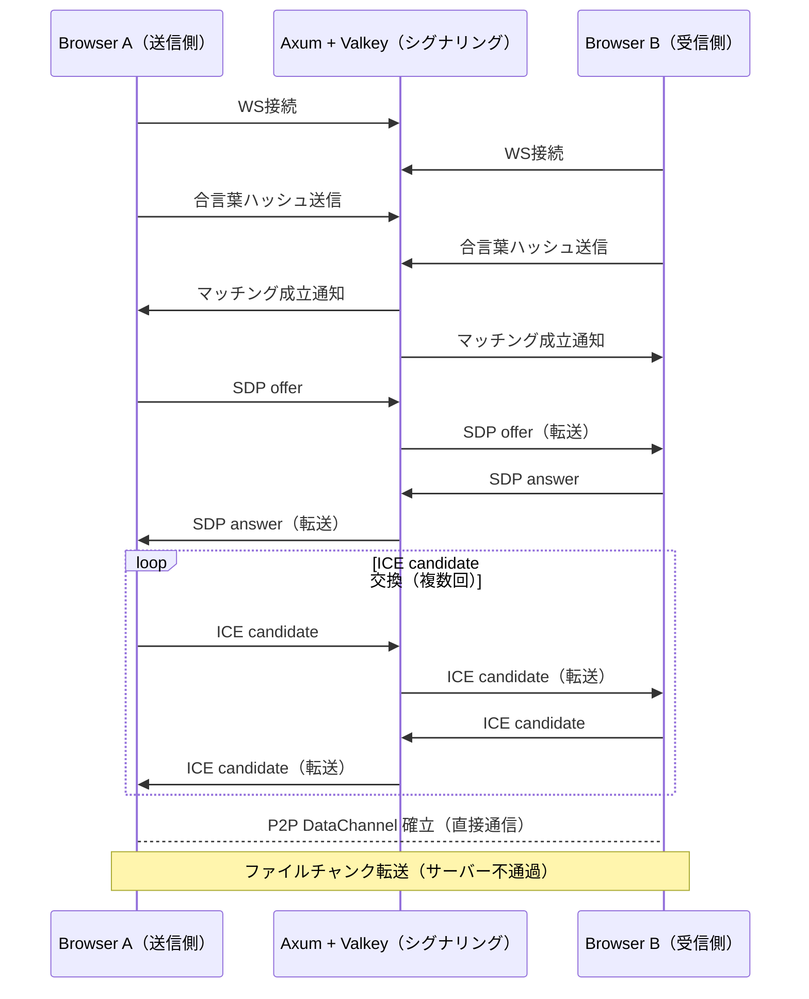
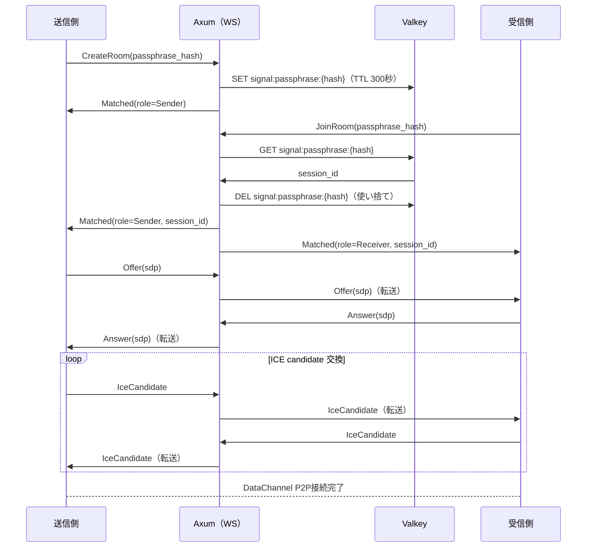
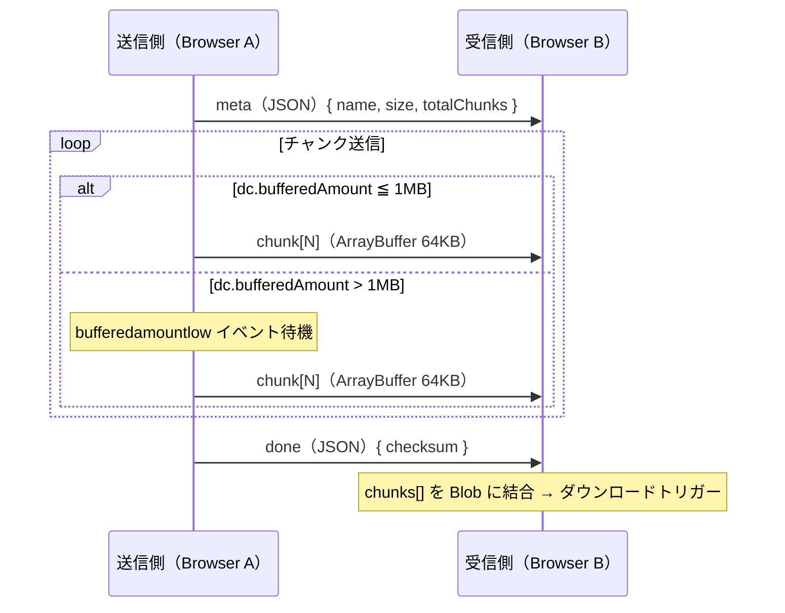

# P2Pファイル転送 実装方針

「合言葉」を用いたブラウザ間P2Pファイル転送の設計ドキュメント。

---

## 概要

ユーザーが口頭で伝えた「合言葉」を介し、**サーバーを経由せずにブラウザ間で直接ファイルを転送**する機能。

- ファイルの実体はサーバーを通過しない（プライバシー保護）
- サーバーは接続確立の仲介（シグナリング）のみ担う
- NAT越えにより、異なるネットワーク間でも動作する

---

## アーキテクチャ全体像



---

## シグナリングサーバ設計（Rust / Axum）

### 役割

| 処理 | 担当 |
|------|------|
| 合言葉のマッチング | Valkey（TTL付きで保持） |
| ルーム管理（ペア保持） | Valkey |
| SDP / ICE candidate の中継 | Axum WebSocket |
| ファイルデータの中継 | **行わない**（P2P直接転送） |

### Valkey データ構造

```
# 合言葉 → セッションID のマッピング（TTL: 300秒）
KEY  signal:passphrase:{hash}   VALUE  {session_id}

# セッション内のピア管理
KEY  signal:room:{session_id}   VALUE  ["peer_a_id", "peer_b_id"]

# ピアのWebSocket送信チャネル（メモリ内）
Arc<DashMap<PeerId, mpsc::Sender<Message>>>
```

### Axum WebSocket エンドポイント

```
GET /ws/signal?session_id={uuid}
```

追加クレート（`Cargo.toml`）:

```toml
dashmap    = "6"
uuid       = { version = "1", features = ["v4", "serde"] }
sha2       = "0.10"   # 合言葉ハッシュ化
```

Axum 0.8 の `axum::extract::ws` は組み込み済みのため、WebSocket処理に追加クレート不要。

### メッセージ型定義

```rust
#[derive(Serialize, Deserialize)]
#[serde(tag = "type", rename_all = "snake_case")]
pub enum SignalMessage {
    // ① ルーム作成（送信側）
    CreateRoom { passphrase_hash: String },
    // ② ルーム参加（受信側）
    JoinRoom   { passphrase_hash: String },
    // ③ マッチング成立通知
    Matched    { role: PeerRole, session_id: String },
    // ④ SDP交換
    Offer      { sdp: String },
    Answer     { sdp: String },
    // ⑤ ICE candidate 交換
    IceCandidate { candidate: String, sdp_mid: String, sdp_mline_index: u16 },
    // エラー
    Error      { code: ErrorCode, message: String },
}

#[derive(Serialize, Deserialize)]
#[serde(rename_all = "snake_case")]
pub enum PeerRole { Sender, Receiver }
```

---

## 接続確立シーケンス



---

## チャンク転送プロトコル（DataChannel）

### パラメータ

| 項目 | 値 | 理由 |
|------|-----|------|
| `CHUNK_SIZE` | 64 KB | ブラウザ間互換の安全な最大値 |
| `MAX_BUFFER` | 1 MB | bufferedAmount の上限 |
| `dc.binaryType` | `arraybuffer` | Blob より一貫性が高い |

### メッセージフォーマットとフロー



メッセージの内容:

| # | 型 | 内容 |
|---|-----|------|
| 1 | JSON文字列 | `{ type: "meta", name, size, totalChunks }` |
| 2〜N | ArrayBuffer | チャンクデータ（64KB単位） |
| N+1 | JSON文字列 | `{ type: "done", checksum }` |

### フロー制御（必須）

`bufferedAmount` を監視しないと大容量ファイルでブラウザのメモリが枯渇する。

```typescript
const CHUNK_SIZE = 64 * 1024;
const MAX_BUFFER = 1 * 1024 * 1024;

async function sendFile(dc: RTCDataChannel, file: File) {
  // メタ情報を先送
  dc.send(JSON.stringify({
    type: 'meta',
    name: file.name,
    size: file.size,
    totalChunks: Math.ceil(file.size / CHUNK_SIZE),
  }));

  let offset = 0;
  while (offset < file.size) {
    // バッファ満杯なら low イベントまで待機
    if (dc.bufferedAmount > MAX_BUFFER) {
      await new Promise<void>(resolve => {
        dc.bufferedAmountLowThreshold = MAX_BUFFER / 2;
        dc.onbufferedamountlow = () => resolve();
      });
    }
    const slice = file.slice(offset, offset + CHUNK_SIZE);
    dc.send(await slice.arrayBuffer());
    offset += CHUNK_SIZE;
  }

  dc.send(JSON.stringify({ type: 'done' }));
}
```

### 受信・再構築

```typescript
type RecvState = { meta: FileMeta | null; chunks: ArrayBuffer[] };

const state: RecvState = { meta: null, chunks: [] };

dc.onmessage = ({ data }) => {
  if (typeof data === 'string') {
    const msg = JSON.parse(data);
    if (msg.type === 'meta') {
      state.meta = msg;
    } else if (msg.type === 'done') {
      const blob = new Blob(state.chunks);
      triggerDownload(blob, state.meta!.name);
      state.chunks = [];
    }
  } else {
    state.chunks.push(data as ArrayBuffer);
  }
};
```

---

## フロントエンド実装（TanStack Start）

### SSR への注意

TanStack Start は SSR を行うため、`RTCPeerConnection` など**ブラウザ専用APIはサーバーサイドで実行されない**ようにガードが必要。

```typescript
// hooks/useWebRTC.ts
import { useEffect, useRef } from 'react';

export function useWebRTC() {
  const pcRef = useRef<RTCPeerConnection | null>(null);

  useEffect(() => {
    // useEffect はクライアントのみで実行される
    pcRef.current = new RTCPeerConnection({
      iceServers: [
        { urls: 'stun:stun.l.google.com:19302' },
        {
          urls: import.meta.env.VITE_TURN_URL,
          username: import.meta.env.VITE_TURN_USER,
          credential: import.meta.env.VITE_TURN_CREDENTIAL,
        },
      ],
    });

    return () => pcRef.current?.close();
  }, []);

  return pcRef;
}
```

### TanStack Router との統合

WebRTCの状態（接続状態・転送進捗）はルート外のグローバル状態（Context or Jotai等）で管理し、ルートコンポーネントは表示に専念させる。

```
src/
  lib/
    webrtc/
      useWebRTC.ts        # RTCPeerConnection 管理
      useSignaling.ts     # WebSocket シグナリング
      useSender.ts        # 送信ロジック（chunkingあり）
      useReceiver.ts      # 受信・再構築ロジック
  routes/
    share/
      index.tsx           # 合言葉入力 + 送信UI
      receive.tsx         # 受信待機 + ダウンロードUI
```

---

## TURN サーバ

NAT のタイプによってP2P直接接続が失敗するケースがある。TURNはリレーフォールバックとして**必須**。

| NAT タイプ | P2P直接 | TURNが必要 |
|-----------|---------|-----------|
| Full-cone / Restricted | ✅ 成功 | 不要 |
| Port-restricted | △ 多くは成功 | 場合による |
| Symmetric（法人・モバイル）| ❌ 失敗 | **必須** |

### 推奨構成

自前の Valkey サーバーが既にある環境であれば、同じVPS に **coturn** を立てるのが最もコスト効率が良い。

```bash
# coturn の最小設定
listening-port=3478
tls-listening-port=5349
fingerprint
lt-cred-mech
user=appuser:password
realm=your-domain.com
```

または **Cloudflare TURN**（無料枠あり）を利用する。

---

## セキュリティ考慮事項

| リスク | 対策 |
|--------|------|
| 合言葉の総当たり | Valkeyに TTL 300秒 + 試行回数制限（5回でブロック） |
| 合言葉の盗聴 | 送信前にクライアントサイドで SHA-256 ハッシュ化して送信 |
| なりすまりマッチング | セッションIDをUUIDv4で生成、使い捨て（1回マッチで即削除） |
| TURNリレー盗聴 | TURNはDTLS暗号化が標準適用（WebRTCの仕様） |
| 大容量DoS | ファイルサイズ上限をフロントとDataChannel両方で検証 |

---

## 実装ロードマップ

### Phase 1 — シグナリングサーバ
- [ ] `Cargo.toml` に `dashmap`, `sha2`, `uuid` 追加
- [ ] `src/handlers/signal.rs` — WebSocket ハンドラ作成
- [ ] `src/routes/signal.rs` — `/ws/signal` エンドポイント追加
- [ ] Valkey接続を既存の `utils/redis.rs` で再利用

### Phase 2 — フロントエンド WebRTC
- [ ] `src/lib/webrtc/useSignaling.ts` — WS接続 + メッセージ型
- [ ] `src/lib/webrtc/useWebRTC.ts` — RTCPeerConnection管理
- [ ] `src/lib/webrtc/useSender.ts` — チャンク送信（フロー制御付き）
- [ ] `src/lib/webrtc/useReceiver.ts` — 受信・Blob再構築

### Phase 3 — UI
- [ ] 合言葉生成・入力UI（shadcn/ui）
- [ ] 転送進捗バー
- [ ] 受信完了・ダウンロードトリガー

### Phase 4 — インフラ
- [ ] coturn または Cloudflare TURN の設定
- [ ] `VITE_TURN_URL` / `VITE_TURN_USER` / `VITE_TURN_CREDENTIAL` 環境変数追加
- [ ] Prometheusでシグナリング接続数・TURN使用率を監視
